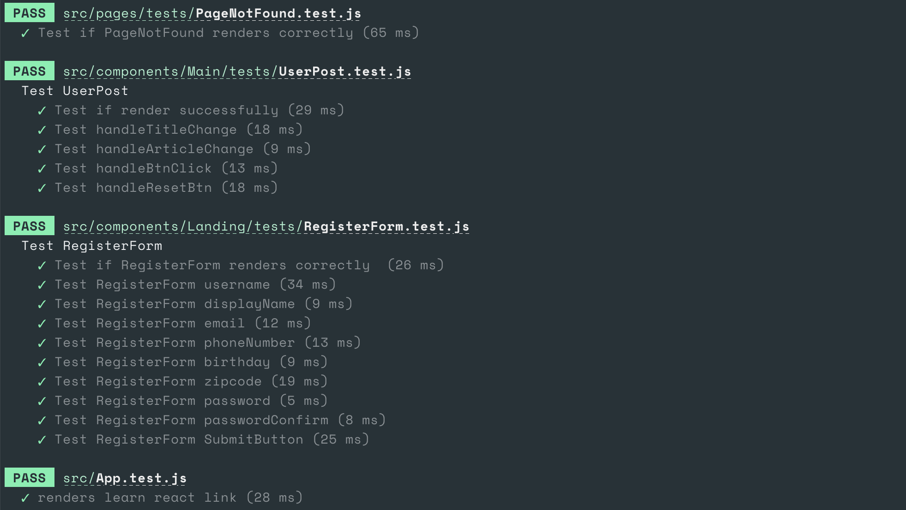
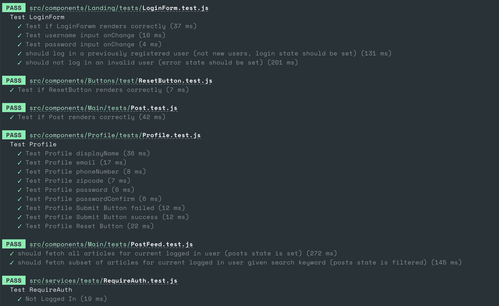
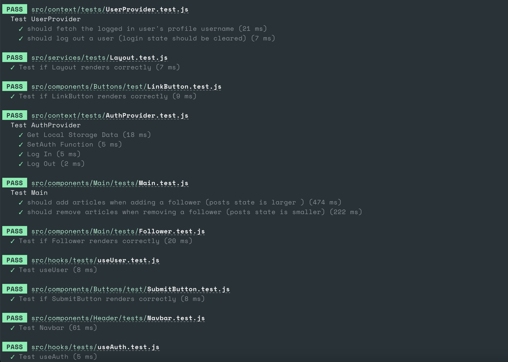
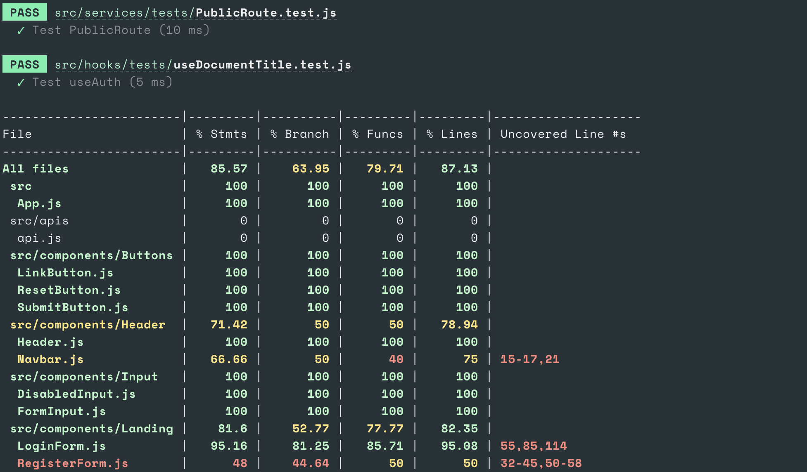
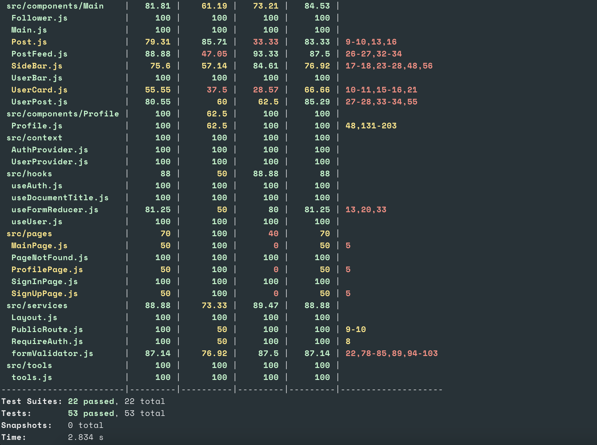

# RiceBook Frontend

## Table of Contents

-   [Getting Started](#getting-started)
-   [Using this repo](#please-read-this-before-using-this-repo)
-   [Grading Instruction](#grading-instruction)
-   [Information](#information)
-   [Test Coverage](#test-coverage)

## Getting Started

To get a local copy up and running follow these simple steps.

### Prerequisites

1. Install [Node.js](https://nodejs.org/en/download/).
2. Install [npm](https://www.npmjs.com/get-npm).
3. Install depenencies for frontend and backend respectively.

    For frontend:

    ```bash
        npm install
    ```

### Run App

1. Change into the repo directory: `cd assignment-4`
2. Run the node server (will start on port 3000 by default):

    ```bash
        npm start
    ```

## Please Read This Before Using This Repo

-   If you decide to fork this repo, you have to add a link to this repo in your home page and do not use the website logo from [this repo](https://github.com/yuchia0221/yuchiachen.github.io) without my explicit permission.

## Grading Instruction

There are several users already in the app. Below are their usernames. You can use these usernames to follow more people.

-   chenaa
-   bangkao
-   leobing
-   naomi
-   weiliu
-   Spy
-   mack

## Test Coverage






